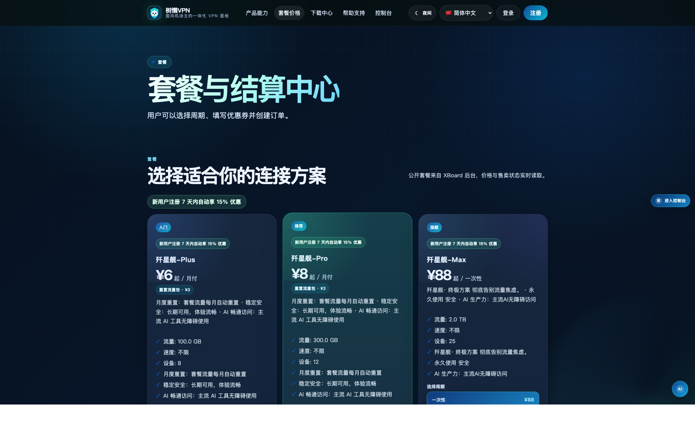
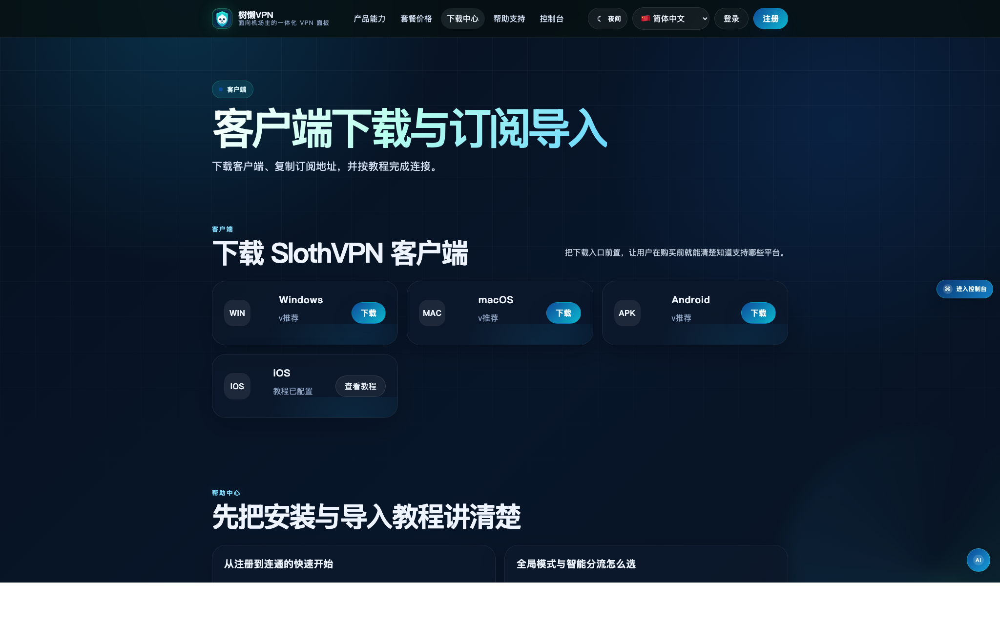
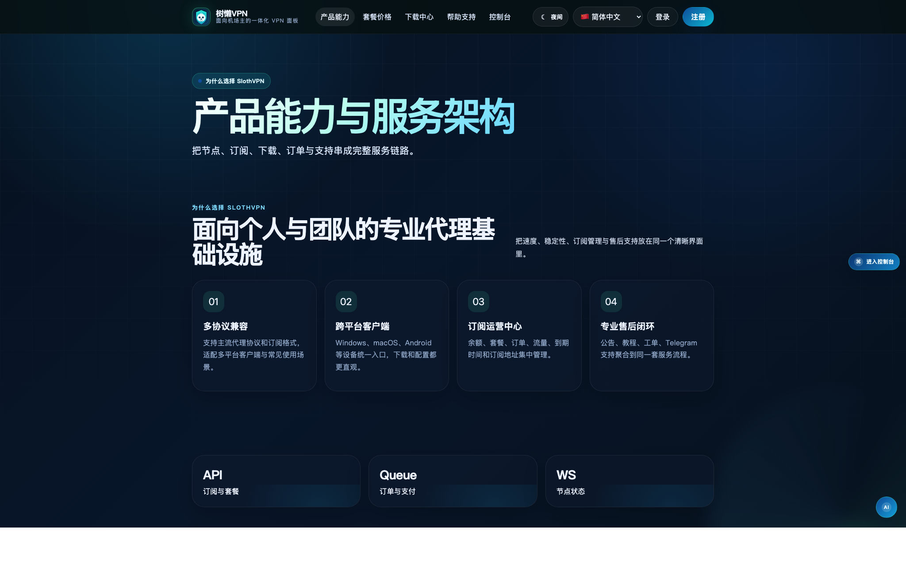
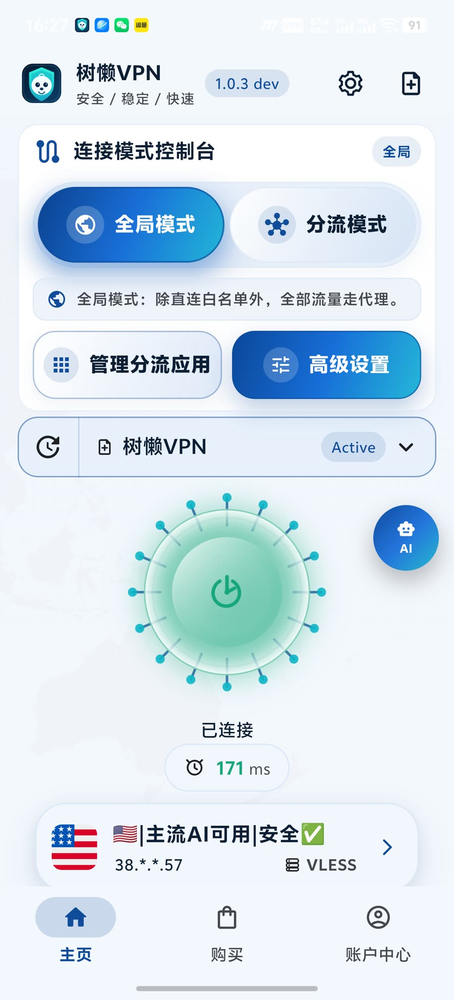
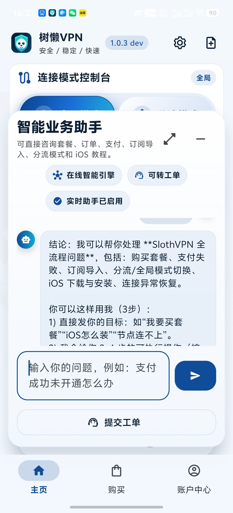
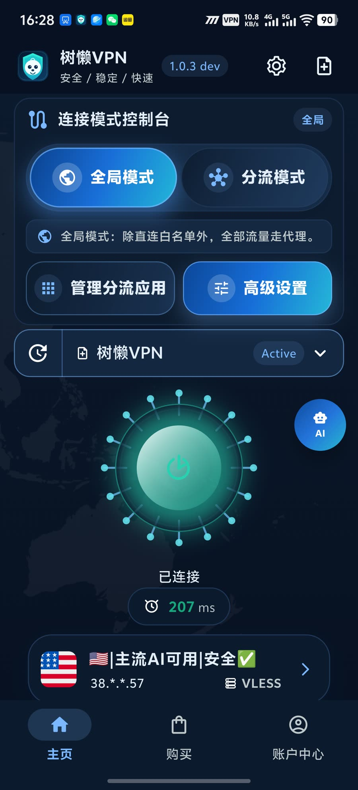
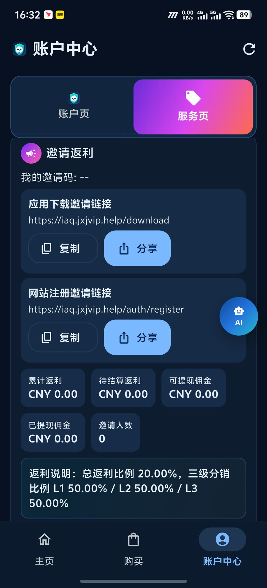
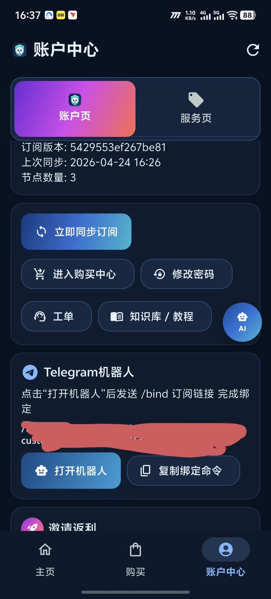
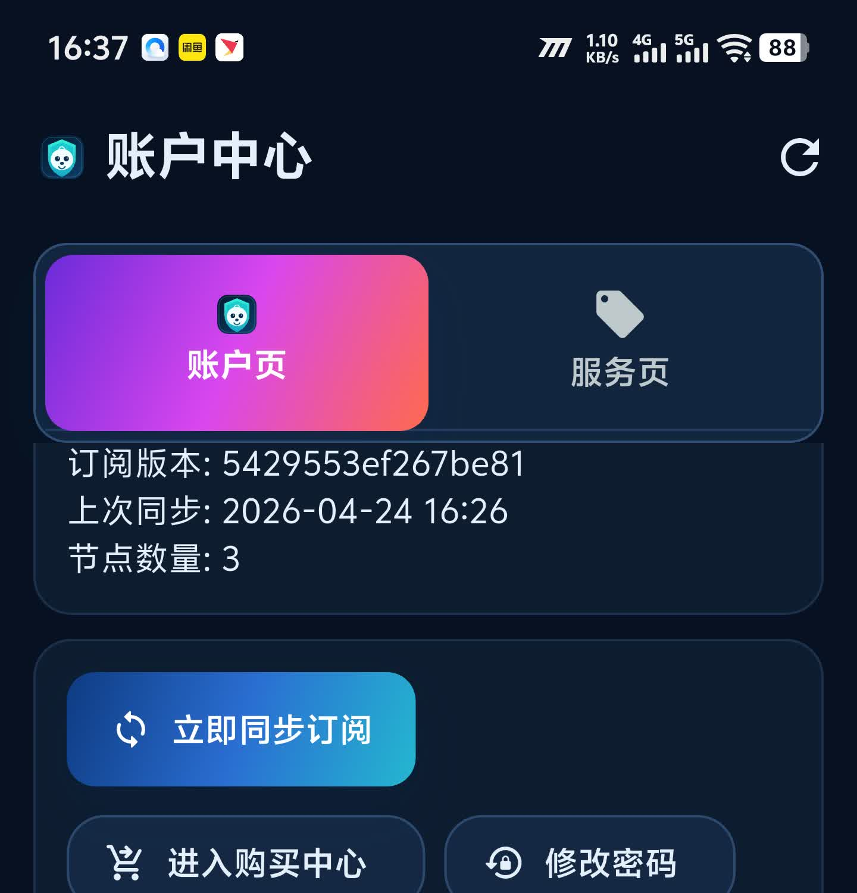

# 树懒VPN（SlothVPN）白牌面板

面向机场主、代理网络运营者和已有 XBoard 站点的白牌交付方案。我们提供一套可以直接上线收款的品牌面板，而不是只交付一个原生后台：前台成交页、用户控制台、后台运营配置、客户端下载中心、iOS 教程、AI 业务助手、Android / Windows / macOS 安装包和交付验收流程一起打包。自研API对接应用端（端到端一体化的产品）

[公开演示站](https://shulaiyun.github.io/Sloth-VPN/) | [真实线上前台](https://admin.shulaiyun.top/pricing) | [用户控制台](https://admin.shulaiyun.top/portal) | [Telegram 咨询](https://t.me/shulai2026)

## 产品定位

树懒VPN 白牌面板适合想把 VPN / 机场服务做成独立品牌的机主：

- 新客户可以从零开站，拿到一套可注册、可购买、可下载、可售后的品牌面板。
- 旧 XBoard 客户可以做同库迁移，保留用户、套餐、订单、优惠券、礼品卡和工单等核心数据。
- 需要定制品牌的客户可以替换品牌名、Logo、首页标语、下载链接、iOS 教程、AI 助手文案和安装包名称。
- 不会部署的客户可以走代部署交付，你方提供服务器、域名和品牌资料，我们完成上线和验收。

## 相比原生 XBoard 新增了什么

原生 XBoard 更适合作为后台基础框架。树懒云白牌版在它的基础上补齐了面向用户成交、客户端下载、售后支持和品牌交付的产品层能力。

| 能力 | 原生 XBoard | 树懒云白牌面板 |
| --- | --- | --- |
| 用户前台 | 默认更偏后台登录和基础用户中心 | SlothPro 品牌前台，套餐、下载、教程、帮助、控制台入口集中展示 |
| 品牌定制 | 需要手动改主题和配置 | 品牌名、Logo、标语、下载入口、iOS 教程、AI 文案按客户交付 |
| 客户端下载 | 通常需要额外页面或文档承接 | Windows、macOS、Android 下载和 iOS 教程统一展示 下载链接可邀请返利归因|
| iOS 引导 | 多数依赖文字说明 | 站内教程弹窗，支持共享账号入口和 Apple 官方外区账号注册入口 |
| 订单体验 | 基础下单能力 | 新用户优惠展示、优惠券叠加提示、未支付订单复用和继续支付优化 |
| 售后支持 | 工单为主 | AI 业务助手先回答套餐、支付、导入、分流、iOS 等问题，解决不了再转工单 可接入大模型，如大模型超时自动切换本地业务兜底|
| 白牌交付 | 需要项目制改造 | 标准化 SOP，支持新开站、XBoard 同库迁移、品牌安装包和验收报告 |

## 真实展示截图

这些截图来自真实部署和实机 App，用来给客户确认“交付后大概长什么样”。每个客户上线时，也可以按客户品牌生成同类验收截图。

### Web 前台与控制台

| 前台套餐与优惠 | 下载中心与 iOS 教程 | 用户控制台 |
| --- | --- | --- |
|  |  |  |

### Android App 实机界面

| 连接首页 | AI 助手 | 深色连接 |
| --- | --- | --- |
|  |  |  |

| 邀请返利 | 账户与同步 | 账户中心总览 |
| --- | --- | --- |
|  |  |  |

## 交付范围

默认采用“一客户一实例”的专属部署模式，不做多个客户共用一个后台的多租户架构。这样更适合机场主迁移、独立品牌运营和故障隔离。

标准交付包含：

- 一套独立 XBoard fork 面板实例
- SlothPro 品牌前台
- 用户控制台与后台运营配置
- 套餐、订单、优惠券、礼品卡、邀请返利、工单和公告管理
- 下载中心与 iOS 教程配置
- AI 业务助手和离线兜底回答
- Android / Windows / macOS 安装包下载入口
- 新开站或 XBoard 同库迁移支持
- 上线验收报告和回滚说明

## 交付流程

1. 收集客户资料：品牌名、Logo、域名、服务器、当前面板、支付方式、邮件/Telegram 配置。
2. 判断交付类型：新开站、XBoard 同库迁移、或其他面板人工评估。
3. 准备品牌清单：生成客户专属 `brand.manifest.json`。
4. 部署客户实例：安装面板、网关、缓存、任务进程和运行配置。
5. 配置业务后台：套餐、优惠、支付、下载地址、iOS 教程、公告、工单和 AI 助手。
6. 打包客户端：按客户品牌输出 Android / Windows / macOS 安装包或下载入口。
7. 验收上线：注册、登录、下单、继续支付、订阅导入、客户端下载、AI 助手和工单流程全部验证。

## iOS 分发策略

第一阶段不把 App Store 独立上架作为成交前置条件。默认提供站内 iOS 教程，包含：

- 共享 Apple ID 获取入口
- Apple 官方外区账号注册入口
- iOS 客户端下载和订阅导入步骤

如客户需要独立上架 App Store 或 TestFlight，需要单独评估 Apple 开发者账号、隐私合规、审核材料和上架成本。

## 仓库结构

- `showcase/`：公开演示站，用于客户了解产品能力和交付效果
- `showcase/assets/screens/`：真实部署截图和 App 实机截图
- `docs/`：部署、迁移、验收和 iOS 分发文档
- `ops/white-label/`：白牌交付资料模板和客户交付脚手架
- `sloth-gateway/`：网关与业务 API
- `Xboard-master/`：XBoard 后端、后台和主题改造
- `android/` `macos/` `windows/` `ios/`：客户端工程与白牌打包方向

## 本地预览演示站

```bash
npm run showcase:serve
```

打开本地地址后可以查看公开演示站。线上 GitHub Pages 地址为：

```text
https://shulaiyun.github.io/Sloth-VPN/
```

## 商业边界

- 第一阶段主推专属部署版，不承诺一个后台管理多个机场主。
- 第一阶段优先支持 XBoard 同库迁移，深度魔改旧站需要人工评估。
- Android / Windows / macOS 可做品牌安装包交付。
- iOS 默认使用教程引导方案，独立上架按客户需求单独报价和评估。
- 公开仓库不包含客户数据、服务器密钥、支付密钥、核心私有部署脚本和真实生产凭据。

## 合规声明

本项目仅用于合法合规场景下的网络连接管理、品牌面板交付和技术研究。使用方需自行确保符合所在地法律法规、平台政策、支付渠道规则和服务条款。
